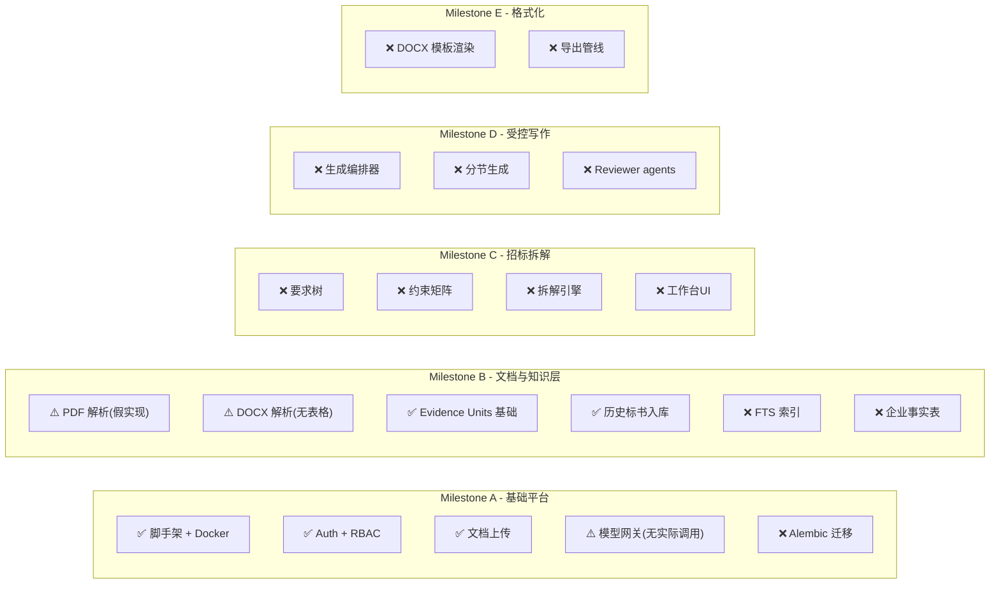

# AIBidder 项目全面评审报告

> 评审日期：2026-03-07 · 评审视角：资深建筑工程投标专家 + AI 架构专家

---

## 一、评审范围

本次评审覆盖以下全部源码与文档：

| 层面 | 文件/目录 | 规模 |
|---|---|---|
| **需求文档** | [requirements.md](file:///Users/palmtom/Projects/aibidder/docs/2026-03-06-ai-bid-writing-platform-requirements.md) | 762 行、18 个章节 |
| **实施计划** | [phase1-plan.md](file:///Users/palmtom/Projects/aibidder/docs/plans/2026-03-06-phase1-implementation-plan.md) + 6 个专项设计/实施文档 | ~1 200 行 |
| **后端 API** | [services/api-server/app/](file:///Users/palmtom/Projects/aibidder/services/api-server/app/) | 35 个文件；6 路由、10 服务、6 核心模块 |
| **数据库模型** | [models.py](file:///Users/palmtom/Projects/aibidder/services/api-server/app/db/models.py) | 15 张表、265 行 |
| **前端** | [src/frontend/app/page.tsx](file:///Users/palmtom/Projects/aibidder/src/frontend/app/page.tsx) + [lib/api.ts](file:///Users/palmtom/Projects/aibidder/src/frontend/lib/api.ts) | 1 834 + 679 行 |
| **Worker** | [services/worker/](file:///Users/palmtom/Projects/aibidder/services/worker/) | 占位 stub（88 字节） |
| **基础设施** | [docker-compose.yml](file:///Users/palmtom/Projects/aibidder/docker-compose.yml) · `.env.example` | 6 容器 |
| **测试** | [tests/](file:///Users/palmtom/Projects/aibidder/services/api-server/tests/) | 13 个测试文件 |

---

## 二、总体评价

### 2.1 做得好的地方

| # | 亮点 | 说明  |
|---|---|---|
| 1 | **需求文档质量高** | 762 行需求文档在投标领域中属于专业水准；明确区分了真值来源 vs 风格来源、evidence_pack vs reuse_pack，这在行业内是正确的安全边界 |
| 2 | **证据/复用双轨制** | `evidence_units`（仅 tender/norm）与 `historical_reuse_units` 严格分层，符合投标实务中"规范/合同是事实来源、历史标书只是参考"的本质要求 |
| 3 | **模型网关抽象** | `model_gateway.py` 实现了 `OpenAICompatibleProvider` + 脱敏 Hook + 审计 Sink，是 BYOK 场景的正确起步 |
| 4 | **BYOK 角色模型矩阵** | 6 个角色（OCR、Navigator、Extractor、Writer、Reviewer、Adjudicator）已在配置中显式定义，与投标实务中的分角色 AI 辅助思路吻合 |
| 5 | **历史泄漏校验** | `historical_leakage_checker` + `risk_marker` 构成了防止历史标书信息泄漏的最小闭环 |
| 6 | **文档全格式支持** | `pdf/docx/doc` 三类输入均有处理路径，`doc → docx` 归一化方案合理（LibreOffice headless） |
| 7 | **测试覆盖意识好** | 13 个测试文件覆盖了 auth、evidence、historical bid、model gateway、runtime settings 等核心路径 |

### 2.2 需要改进的关键领域

> [!CAUTION]
> 以下问题按严重程度排序，前 5 项对项目成败有直接影响。

---

## 三、架构评审

### 3.1 ❌ 数据库迁移完全缺失

**现状**：`bootstrap.py` 使用 `Base.metadata.create_all()` 直接建表，无 Alembic 迁移。

**风险**：
- 开发环境数据库 schema 无法追踪变更历史
- 团队协作时 schema 漂移不可控
- 生产部署时必须手写 DDL 或重建数据库
- 需求文档和计划明确要求 Alembic，但未实施

**建议**：立即引入 Alembic，生成 baseline migration，并将 `create_all` 降级为测试专用。

---

### 3.2 ❌ SQLite 作为开发数据库 — FTS 无法验证

**现状**：本地开发默认使用 SQLite（`session.py` 第 13 行），但需求核心检索能力是 PostgreSQL FTS/BM25。

**问题**：
- `evidence_search.py` 中的证据搜索使用 `ilike` 模拟——与 PostgreSQL `ts_query + ts_rank` 行为相差甚远
- 招标拆解、证据召回、检索排序的质量无法在本地真实验证
- SQLite 不支持 `tsvector`/`GIN` 索引，后续切换时 schema 差异大

**建议**：本地开发也统一使用 Docker Compose 中的 PostgreSQL。SQLite 仅保留用于 CI 单元测试的 fast-path。

---

### 3.3 ❌ Worker 服务为空壳

**现状**：`services/worker/worker/main.py` 仅 88 字节，无任何 Celery/RQ/Arq 初始化。

**影响**：
- 文档解析（PDF OCR 可能几十秒）、招标拆解、生成编排等重型任务目前只能在 HTTP 请求中同步执行
- 用户上传大 PDF 时会因 request timeout 而失败
- 计划中的 `extract → grade → retry` 闭环、`多 reviewer agents` 并行复核等场景依赖异步 worker

**建议**：尽早选定异步方案（建议 Celery + Redis broker），实现最小可用 worker，至少先支持文档解析异步化。

---

### 3.4 ⚠️ 服务边界模糊 — 单体 + 缺少路由分层

**现状**：计划中定义了 9 个逻辑服务（api-gateway、document-service、knowledge-service 等），但代码中只有一个 FastAPI 实例挂载了所有路由。

**问题**：
- `projects.py`（428 行）混合了项目管理、文档上传、证据搜索、泄漏校验
- `workbench.py`（443 行）混合了 6 个业务模块（资料库、拆解、生成、复核、排版、管理）的 CRUD
- 路由间缺少业务隔离，后续拆分微服务时代价大

**建议**：
1. 保持单体部署，但在代码层面按 domain 拆包：`app/domains/{document, knowledge, decomposition, generation, review, formatting, project}`
2. 每个 domain 内含独立的 router、service、schema，通过内部接口交互
3. 此结构为将来拆分微服务提供清晰边界

---

### 3.5 ⚠️ 对象存储未真正接入 MinIO

**现状**：`storage.py` 直接写本地文件系统（`Path(settings.storage_root)`），虽然 Docker Compose 已配置 MinIO。

**问题**：
- 容器环境下 API 容器和 Worker 容器无法共享本地文件系统
- 无法验证分布式存储场景
- 计划中明确要求 MinIO/S3 兼容存储

**建议**：引入 `boto3` 或 `minio-py`，实现 `StorageBackend` 接口，本地可 fallback 到文件系统。

---

## 四、后端代码评审

### 4.1 PDF 解析器功能不足

**现状**：`_parse_pdf_fallback` 直接将 PDF 二进制数据用 UTF-8/Latin-1 decode——这对真正的 PDF 文件根本无法工作。

```python
# document_parser.py L133-168
def _parse_pdf_fallback(source_path, filename):
    data = Path(source_path).read_bytes()
    text = data.decode("utf-8").strip()  # ← PDF 是二进制格式，不是纯文本
```

**影响**：PDF 招标文件（占投标文档 80%+）无法被正确解析。

**建议**：
1. 集成 `Docling`、`PyMuPDF`、`pdfplumber` 等真正的 PDF 解析库
2. 对扫描件 PDF 走 OCR 链路（SiliconFlow OCR）
3. 保留 fallback 但仅用于内容已转换为文本的简单 PDF

---

### 4.2 DOCX 解析器缺少表格和嵌套元素支持

**现状**：`_parse_docx` 仅提取 `<w:p>` 段落文本和 Heading 样式——不处理表格、列表、图片引用。

**影响**：
- 招标文件的评分表、资格表、技术参数表无法提取
- 需求文档明确要求"OCR 表格重建"和"表格语义归类"

**建议**：引入 `python-docx` 库替代手工解析 OOXML XML，或使用 `Docling` 统一处理。

---

### 4.3 认证安全短板

| 问题 | 现状 | 建议 |
|---|---|---|
| JWT Secret | 硬编码 `"change-me-in-production"` | 必须在生产环境强制配置；启动时校验非默认值 |
| Token 刷新 | 无 refresh token 机制 | 长时间写作场景下 token 过期会丢失工作 |
| 密码策略 | 无最短长度/复杂度校验 | 添加基本校验 |
| Rate Limiting | 无登录限频 | 添加 IP 级别限频，防止暴力破解 |

---

### 4.4 API 缺少分页、过滤和排序

**现状**：所有 `list_*` 接口直接返回全量数据，无 `limit/offset/cursor` 分页。

**影响**：当项目、文档、证据等积累到一定规模后会严重影响性能和用户体验。

---

### 4.5 错误处理和日志不够完善

- `document_ingestion.py` 中关键异常场景（如 OCR 超时）只返回 `status="failed"` 和简单 parse_log，缺少结构化错误码
- 请求 middleware 有 `request_logger`，但 service 层缺少统一的结构化日志
- 缺少 `audit_logs` 表的实际写入逻辑（需求文档要求审计日志）

---

## 五、前端评审

### 5.1 ❌ 1834 行单文件前端 — 可维护性极差

**现状**：`page.tsx` 是一个 1834 行的巨型组件，包含：
- 50+ 个 `useState` Hook
- 20+ 个 `async function` 事件处理器
- 全部 UI 渲染逻辑

**问题**：
- 无法独立测试任何业务模块
- 团队协作时必然产生大量合并冲突
- 无路由系统，所有功能堆在一个页面上
- 违反 React 最佳实践（Single Responsibility）

**建议**：
1. 拆分为独立页面路由：`/login`、`/projects`、`/projects/[id]`、`/workbench`、`/settings` 等
2. 按业务提取组件：`LoginPanel`、`ProjectList`、`DocumentUploader`、`EvidenceSearch`、`HistoricalBidPanel`、`WorkbenchModules`、`RuntimeSettings`
3. 引入状态管理（Zustand 或 React Context）替代 50+ useState
4. 引入 `shadcn/ui` 或类似组件库提升 UI 一致性

---

### 5.2 ⚠️ 无错误边界和 Loading 状态管理

- 所有异步操作共用一个 `busyLabel` 状态，无法并行显示多个加载状态
- 无 Error Boundary，组件异常直接白屏
- 无 Suspense / Skeleton 加载模式

---

### 5.3 ⚠️ 缺少设计系统

**现状**：`globals.css` 有 8646 字节的样式，但无 component tokens、design variables、主题系统。

**建议**：按需求文档建议引入 `Tailwind CSS` + `shadcn/ui`，建立一致的设计语言。

---

## 六、数据库模型评审

### 6.1 已有模型（15 张表）对照需求缺口分析

| 需求模型 | 当前状态 | 评估 |
|---|---|---|
| `organizations` | ✅ 已有 | 字段单薄（仅 id + name） |
| `users` | ✅ 已有 | 缺少 last_login、avatar、phone 等 |
| `projects` | ✅ 已有 | 缺少 description、status、deadline |
| `project_members` | ✅ 已有 | 合理 |
| `documents` | ✅ 已有 | 缺少 file_size、mime_type |
| `document_versions` | ✅ 已有 | 缺少 file_hash 去重 |
| `document_artifacts` | ✅ 已有 | 合理 |
| `evidence_units` | ✅ 已有 | 缺少 PostgreSQL FTS 索引（`tsvector` 列） |
| `knowledge_items` / `knowledge_units` | ⚠️ 部分 | `knowledge_base_entries` 仅为浅层登记，缺少 `knowledge_units` 细粒度切分表 |
| `requirements`（要求树） | ❌ 缺失 | 计划中的 `tender_requirements` 未实现 |
| `requirement_constraints`（约束矩阵） | ❌ 缺失 | 计划中已定义但未建表 |
| `draft_sections`（分节写作产物） | ❌ 缺失 | 计划中的 `generated_sections` 未建表 |
| `section_evidence_bindings` | ❌ 缺失 | 证据绑定关系未建表 |
| `verification_issues` | ❌ 缺失 | 校验问题未建表 |
| `review_issues`（问题单） | ❌ 缺失 | `review_runs` 只有批次表，缺少逐项问题单 |
| `audit_logs` | ❌ 缺失 | 需求明确要求审计日志 |
| `rendered_outputs` | ❌ 缺失 | 计划中需要，未实现 |
| 企业事实表 | ❌ 缺失 | `qualifications`、`personnel_assets`、`equipment_assets`、`project_credentials` 均未建 |

### 6.2 FTS 索引未建在 PostgreSQL 上

`evidence_units.fts_text` 和 `historical_bid_sections.fts_text` 字段存在，但未创建 `tsvector` 列和 GIN 索引。当前搜索使用 `ilike` 模式匹配——无法利用 PostgreSQL FTS 的分词、排序和性能优势。

---

## 七、需求 vs 实现差距总览



---

## 八、优化建议优先级矩阵

| 优先级 | 建议 | 影响范围 | 预估工作量 |
|---|---|---|---|
| 🔴 P0 | 引入 Alembic 数据库迁移 | 全栈 | 1-2 天 |
| 🔴 P0 | 修复 PDF 解析器（集成 Docling 或 PyMuPDF） | 后端核心 | 3-5 天 |
| 🔴 P0 | 本地开发切换 PostgreSQL + 建立 FTS 索引 | 数据库 | 2-3 天 |
| 🔴 P0 | 补全 Milestone C 核心数据表 | 数据库 | 2-3 天 |
| 🟡 P1 | 实现异步 Worker（Celery/Arq） | 后端 | 3-5 天 |
| 🟡 P1 | 前端拆分组件 + 引入路由 | 前端 | 5-7 天 |
| 🟡 P1 | DOCX 表格解析增强 | 后端 | 2-3 天 |
| 🟡 P1 | 补充 `audit_logs` 表和写入逻辑 | 后端 | 1-2 天 |
| 🟡 P1 | 对象存储接入 MinIO | 后端 | 2-3 天 |
| 🟡 P1 | API 分页/过滤机制 | 后端 | 2-3 天 |
| 🟢 P2 | 后端按 domain 拆包 | 架构 | 3-5 天 |
| 🟢 P2 | JWT 安全增强（refresh token、rate limit） | 安全 | 2-3 天 |
| 🟢 P2 | 前端设计系统（Tailwind + shadcn/ui） | 前端 | 3-5 天 |
| 🟢 P2 | SSE 任务进度推送 | 全栈 | 3-5 天 |

---

## 九、修订版实施规划

基于以上评审，下面是修订后的分阶段实施规划，重点调整了当前差距最大的基础平台和文档层能力。

### Phase 1-Alpha（基础补强）— 建议 2 周

> 目标：修复基础设施短板，使后续里程碑可以在正确的地基上推进。

- [ ] 引入 Alembic，生成 baseline migration，移除 `create_all` 生产路径
- [ ] 本地开发默认连接 Docker Compose PostgreSQL，去除 SQLite 作为默认开发库
- [ ] 为 `evidence_units.fts_text` 和 `historical_bid_sections.fts_text` 创建 `tsvector` 列 + GIN 索引
- [ ] 实现 `StorageBackend` 接口，支持 MinIO（S3 兼容）和本地文件系统两种后端
- [ ] 实现最小 Celery Worker：支持文档解析异步化
- [ ] 补建数据库表：`tender_requirements`、`requirement_constraints`、`generated_sections`、`section_evidence_bindings`、`verification_issues`、`review_issues`、`audit_logs`
- [ ] 按 domain 拆分后端代码结构
- [ ] JWT 安全加固：启动时校验非默认 secret、添加 refresh token

### Phase 1-Beta（文档解析增强）— 建议 2~3 周

> 目标：PDF/DOCX 解析达到投标级可用标准。

- [ ] 集成 Docling 或 PyMuPDF 作为 PDF 解析主路径
- [ ] 集成 SiliconFlow OCR 作为扫描件 PDF 降级路径
- [ ] `python-docx` 替代手工 OOXML 解析，支持表格、列表、图片引用提取
- [ ] 实现章节映射与证据锚点生成（含页码）
- [ ] 实现 `evidence_unit_builder` 表格文本提取（`table_text` 类型）
- [ ] 证据搜索从 `ilike` 切换到 PostgreSQL `to_tsquery + ts_rank`
- [ ] API 统一分页机制（cursor-based 或 limit/offset）
- [ ] 补建 `audit_logs` 写入逻辑

### Phase 1-Gamma（招标拆解 + 前端重构）— 建议 3~4 周

> 目标：实现招标拆解引擎 + 前端可用工作台。

**后端**
- [ ] 实现招标拆解引擎：导航 → 并行提取 → 汇总
- [ ] 7 类拆解成果持久化（基础信息、资格要求、评分标准、投标要求、废标条款、提交清单、合同风险）
- [ ] `extract → grade → retry` 提取闭环
- [ ] SSE 任务进度推送
- [ ] 企业事实表建设（`qualifications`、`personnel_assets`、`equipment_assets`、`project_credentials`）

**前端**
- [ ] 引入路由系统（Next.js App Router 已就绪但未使用）
- [ ] 拆分组件：`LoginPage`、`ProjectDashboard`、`DocumentUploader`、`EvidencePanel`、`WorkbenchConsole`、`SettingsDrawer`
- [ ] 引入 Tailwind CSS + shadcn/ui 设计系统
- [ ] 招标拆解工作台 UI：任务总览、7 类拆解卡片、流程状态、证据联动

### Phase 1-Delta（受控写作 + 格式化）— 建议 3~4 周

> 目标：打通最小写作闭环。

- [ ] 实现生成编排器（`plan → retrieve → draft → verify`）
- [ ] 双路取证：FTS 文本证据 + SQL 企业事实
- [ ] 分节生成与改写
- [ ] 证据绑定持久化
- [ ] 跨章节一致性校验
- [ ] DOCX 模板渲染（`docxtpl`）
- [ ] 导出版本留痕

### Phase 1-Epsilon（复核 + 交付）— 建议 2~3 周

> 目标：实现多维 reviewer 复核层，完成 MVP 验收。

- [ ] 多 reviewer agents 并行审稿（合规、一致性、评分覆盖、合同风险、证据支撑）
- [ ] Adjudicator 汇总结论
- [ ] 结构化问题单（`review_issues`）
- [ ] 严重问题阻断导出
- [ ] 成品回流再入库
- [ ] 全链路验收测试
- [ ] 降级策略与重试机制完善

---

## 十、关键风险提示

> [!WARNING]
> 1. **PDF 解析质量**是整个系统的瓶颈——招标文件以 PDF 为主，当前解析器不可用。建议在 Phase 1-Beta 优先验证 Docling 在跨页表格、评分表上的表现。
> 2. **FTS 索引缺失**意味着当前证据搜索质量无法代表生产环境行为，所有搜索相关的 demo 结果不可信。
> 3. **Worker 缺失**使得所有重型任务（解析、拆解、生成、复核）只能同步执行，大文件场景必然超时。
> 4. **前端单文件架构**会在招标拆解工作台开发时成为严重阻碍——建议在 Gamma 阶段前完成拆分。

---

## 十一、结论

项目需求文档和实施计划的质量是**优秀的**——对投标场景的理解、真值/风格来源分层、双轨证据体系的设计思路在行业中属于领先水准。

但当前代码实现与计划之间存在**显著差距**：
- Milestone A（基础平台）完成度约 **60%**（缺 Alembic、MinIO、Worker）
- Milestone B（文档与知识层）完成度约 **40%**（PDF 解析假实现、FTS 未建、企业事实表缺失）
- Milestone C/D/E **尚未开始**

建议团队按修订版规划（Alpha → Beta → Gamma → Delta → Epsilon）逐步推进，优先补强基础设施短板，再向上构建业务能力。核心投入应聚焦在 **PDF 解析质量** 和 **FTS 索引建设** 上——这两项直接决定了招标拆解和证据检索的成败。
